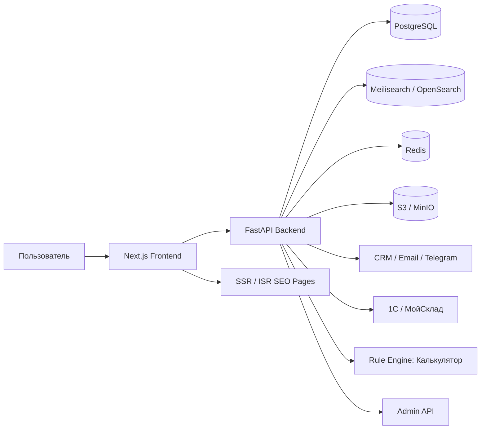
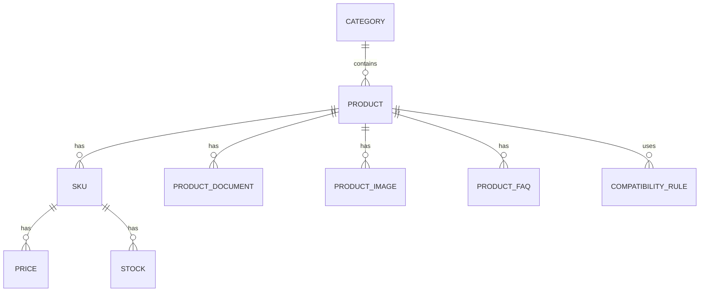
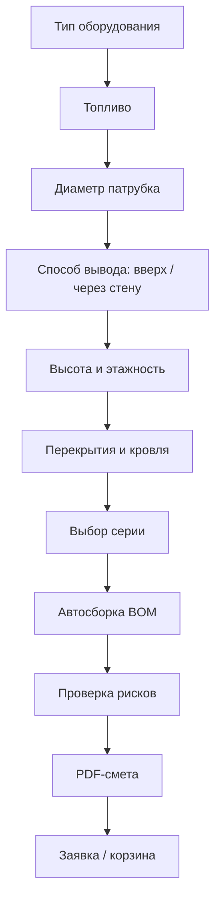

# Архитектура приложения для сайта продажи дымоходов

Стек: **FastAPI backend + Next.js frontend**  
Цель: построить не просто интернет-магазин, а систему подбора и продажи безопасных дымоходных комплектов: каталог, SEO, карточки, конфигуратор, BOM-смета, заявки, админка и база знаний.

---

## 1. Продуктовая идея

Главный продукт сайта — не отдельная труба, а **правильно собранный дымоходный комплект**.

Сайт должен закрывать три сценария:

1. **Новичок**  
   Не знает, какие детали нужны. Ему нужен пошаговый подбор.

2. **Покупатель с конкретной задачей**  
   Ищет “дымоход для бани”, “сэндвич труба 115”, “дымоход для газового котла”. Ему нужны SEO-посадочные и быстрый каталог.

3. **Монтажник / профессионал**  
   Знает параметры. Ему нужен быстрый поиск, фильтры, спецификация, повтор заказа.

---

## 2. High-level архитектура



---

## 3. Рекомендуемая структура репозитория

```text
chimney-platform/
├── apps/
│   ├── web/                         # Next.js frontend
│   │   ├── app/
│   │   ├── components/
│   │   ├── features/
│   │   ├── entities/
│   │   ├── shared/
│   │   └── next.config.ts
│   │
│   └── admin/                       # можно позже выделить, MVP может жить в /web/admin
│
├── backend/
│   ├── app/
│   │   ├── main.py
│   │   ├── core/
│   │   ├── api/
│   │   ├── modules/
│   │   │   ├── catalog/
│   │   │   ├── products/
│   │   │   ├── calculator/
│   │   │   ├── compatibility/
│   │   │   ├── seo/
│   │   │   ├── content/
│   │   │   ├── leads/
│   │   │   ├── users/
│   │   │   └── admin/
│   │   ├── db/
│   │   ├── schemas/
│   │   ├── services/
│   │   └── workers/
│   ├── alembic/
│   ├── tests/
│   └── pyproject.toml
│
├── packages/
│   ├── api-client/                  # автогенерация клиента из OpenAPI
│   └── shared-types/
│
├── infra/
│   ├── docker-compose.yml
│   ├── nginx/
│   └── deploy/
│
├── docs/
│   ├── product/
│   ├── architecture/
│   ├── api/
│   └── seo/
│
└── README.md
```

---

## 4. Backend: FastAPI

### 4.1 Основные технологии

- **FastAPI** — API.
- **PostgreSQL** — основная база.
- **SQLAlchemy 2.0** — ORM.
- **Alembic** — миграции.
- **Pydantic v2** — DTO и валидация.
- **Redis** — кэш, сессии, фоновые задачи.
- **Celery / RQ / Arq** — фоновые задачи.
- **Meilisearch** на MVP или **OpenSearch** позже — быстрый поиск и фасеты.
- **S3 / MinIO** — изображения, PDF, сертификаты, инструкции.
- **JWT + refresh tokens** — авторизация.

### 4.2 Модули backend

```text
backend/app/modules/
├── catalog/             # дерево категорий, фильтры, фасеты
├── products/            # товары, SKU, характеристики, цены, остатки
├── calculator/          # конфигуратор дымохода, BOM, PDF-смета
├── compatibility/       # правила совместимости
├── seo/                 # мета-теги, sitemap, canonical, schema.org
├── content/             # статьи, FAQ, посадочные страницы
├── leads/               # заявки, формы, статусы, CRM-интеграции
├── users/               # пользователи, роли, кабинет
├── documents/           # сертификаты, паспорта, инструкции
├── reviews/             # отзывы, фото объектов
└── admin/               # административные endpoints
```

---

## 5. Frontend: Next.js

### 5.1 Основные технологии

- **Next.js App Router**.
- **TypeScript**.
- **React Server Components** для SEO-страниц.
- **TanStack Query** для клиентских данных.
- **Zod** для валидации форм.
- **Tailwind CSS** или CSS Modules.
- **shadcn/ui** для админки и сложных форм.
- **next-sitemap** или собственная генерация sitemap через API.

### 5.2 Структура frontend

```text
apps/web/
├── app/
│   ├── page.tsx
│   ├── catalog/
│   │   ├── page.tsx
│   │   ├── [categorySlug]/
│   │   │   └── page.tsx
│   │   └── [...filters]/
│   │       └── page.tsx
│   ├── product/
│   │   └── [slug]/
│   │       └── page.tsx
│   ├── solutions/
│   │   └── [slug]/
│   │       └── page.tsx
│   ├── calculator/
│   │   └── page.tsx
│   ├── blog/
│   │   └── [slug]/
│   │       └── page.tsx
│   ├── admin/
│   └── account/
│
├── features/
│   ├── catalog-filter/
│   ├── product-card/
│   ├── calculator-wizard/
│   ├── lead-form/
│   ├── seo-blocks/
│   └── search/
│
├── entities/
│   ├── product/
│   ├── category/
│   ├── calculator-project/
│   ├── lead/
│   └── article/
│
└── shared/
    ├── api/
    ├── ui/
    ├── config/
    └── lib/
```

---

## 6. Доменные сущности

### 6.1 Каталог



Ключевое правило каталога: `PRODUCT` и `SKU` нельзя смешивать.

- `PRODUCT` — логический тип товара: одноконтурная труба, сэндвич-труба, отвод 45°, отвод 90°,
  тройник, адаптер.
- `SKU` / `Variant` — конкретная покупаемая позиция: диаметр, длина, марка стали, толщина,
  утепление, цена, артикул, наличие.
- Один `PRODUCT` имеет много `SKU`.
- SEO-важный `SKU` должен иметь собственный canonical URL.
- Frontend использует один переиспользуемый Product Detail component, который получает данные
  выбранного варианта из backend API. Дублировать React-страницы под диаметры, длины и стали нельзя.

Подробное решение зафиксировано в `PRODUCT_VARIANT_SEO_ARCHITECTURE.md`.

### 6.2 Основные таблицы

#### categories

```text
id
parent_id
slug
name
h1
description
seo_title
seo_description
sort_order
is_active
indexing_policy
created_at
updated_at
```

#### products

```text
id
category_id
brand_id
series_id
slug
name
short_description
description
product_type
application_tags
is_active
seo_title
seo_description
h1
created_at
updated_at
```

#### skus

```text
id
product_id
article
barcode
diameter_inner
diameter_outer
steel_grade_inner
steel_grade_outer
steel_thickness_inner
steel_thickness_outer
insulation_thickness
temperature_max
connection_type
length_mm
weight_kg
price
old_price
stock_status
is_active
```

#### attributes

```text
id
code
name
unit
type
is_filterable
is_comparable
is_required
```

#### product_attribute_values

```text
product_id
sku_id
attribute_id
value_string
value_number
value_bool
value_json
```

---

## 7. Калькулятор / конфигуратор дымохода

### 7.1 Цель

Калькулятор должен собирать **полный комплект**, а не просто считать цену.

Результат:

- схема;
- спецификация BOM;
- 3 варианта комплекта: эконом / оптимум / премиум;
- предупреждения по безопасности;
- PDF-смета;
- заявка инженеру.

### 7.2 Сценарий пользователя



### 7.3 Основные сущности калькулятора

#### calculator_projects

```text
id
public_id
user_id
session_id
status
equipment_type
fuel_type
equipment_brand
equipment_model
outlet_diameter
route_type
building_floors
total_height_mm
roof_type
roof_angle
wall_passage
ceiling_passages_count
selected_series_id
result_json
created_at
updated_at
```

#### calculator_bom_items

```text
id
project_id
sku_id
product_id
quantity
role
is_required
reason
sort_order
```

#### compatibility_rules

```text
id
rule_type
name
conditions_json
actions_json
severity
message
is_active
version
```

Примеры `rule_type`:

- `equipment_to_diameter`
- `fuel_to_steel_grade`
- `route_to_required_parts`
- `roof_to_flashing`
- `temperature_to_series`
- `safety_warning`

### 7.4 Rule Engine

На MVP правила можно хранить в JSON в базе.

Пример:

```json
{
  "rule_type": "fuel_to_steel_grade",
  "conditions": {
    "fuel_type": ["wood", "coal"],
    "temperature_min": 600
  },
  "actions": {
    "required_steel_grades": ["AISI 304", "AISI 316L", "AISI 310S"],
    "exclude_steel_grades": ["AISI 430"]
  },
  "severity": "warning",
  "message": "Для высокотемпературных печей не рекомендуется использовать внутренний контур из AISI 430."
}
```

---

## 8. SEO-архитектура

### 8.1 Типы страниц

```text
/catalog/
/catalog/sendvich-dymohody/
/catalog/odnostennye-truby/
/catalog/truby/diametr-115/
/catalog/sendvich-dymohody/diametr-115/
/solutions/dymohod-dlya-bani/
/solutions/dymohod-dlya-gazovogo-kotla/
/solutions/dymohod-dlya-kamina/
/solutions/gilzovanie-kirpichnoy-shahty/
/calculator/
/blog/kak-vybrat-dymohod/
/blog/aisi-304-ili-aisi-430/
/delivery/moskva/
/montazh/sankt-peterburg/
```

### 8.2 Правила индексации фильтров

Индексировать:

- категория + популярный диаметр;
- категория + назначение;
- категория + бренд;
- сценарные страницы;
- региональные страницы с реальным сервисом.

Не индексировать:

- случайные комбинации 4+ фильтров;
- сортировку;
- пагинацию с параметрами;
- параметры цены;
- внутренние поисковые страницы.

### 8.3 SEO-сущность

#### seo_pages

```text
id
url_path
page_type
entity_type
entity_id
title
description
h1
intro_text
bottom_text
canonical_url
robots_policy
schema_type
is_active
updated_at
```

### 8.4 Canonical URL для вариантов товаров

Индексируемой товарной страницей является сочетание семейства `Product` и диаметра — главного
параметра совместимости. Все исполнения рендерятся через один Product Detail component.

Примеры:

```text
/product/odnostennaya-truba-d115
/product/odnostennaya-truba-d150
/product/sendvich-truba-d100-200
```

Где:

- `odnostennaya-truba` или `sendvich-truba` — slug семейства;
- `d115` или `d100-200` — индексируемый диаметр;
- длина, толщина и марки стали выбираются внутри страницы и не создают новый canonical URL.

При выборе другого варианта frontend должен:

- обновить путь только при смене диаметра;
- убрать технический параметр SKU из адресной строки после выбора;
- запросить у backend данные нового Variant/SKU;
- обновить цену, артикул, характеристики, документы, чертежи, совместимость и наличие;
- сохранить общий layout карточки.

Переход с `?sku=<артикул>` допустим для точного восстановления выбранного исполнения, но такая
страница получает `noindex,follow` и canonical на чистый URL семейства с диаметром. UUID не является
публичным идентификатором. Sitemap содержит только чистые URL `Product + диаметр`.

Страница должна формировать:

- `title`;
- `description`;
- `h1`;
- `canonical_url`;
- OpenGraph metadata;
- `Schema.org Product` + `Offer`;
- breadcrumbs.

### 8.5 Schema.org

Использовать:

- `Product`
- `Offer`
- `AggregateRating`
- `FAQPage`
- `BreadcrumbList`
- `HowTo`
- `Organization`
- `LocalBusiness`

---

## 9. API дизайн

### 9.1 Public API

```text
GET    /api/v1/catalog/tree
GET    /api/v1/catalog/categories/{slug}
GET    /api/v1/catalog/categories/{slug}/products
GET    /api/v1/products/{product_slug}
GET    /api/v1/products/{product_slug}/variants
GET    /api/v1/products/{product_slug}/variants/{variant_slug}
GET    /api/v1/products/{product_slug}/variants/{variant_slug}/related
GET    /api/v1/search?q=

GET    /api/v1/seo/page?path=
GET    /api/v1/content/articles/{slug}
GET    /api/v1/content/faq

POST   /api/v1/calculator/projects
PATCH  /api/v1/calculator/projects/{id}
POST   /api/v1/calculator/projects/{id}/calculate
GET    /api/v1/calculator/projects/{id}/result
GET    /api/v1/calculator/projects/{id}/pdf

POST   /api/v1/leads
POST   /api/v1/leads/calculator
```

### 9.2 Admin API

```text
POST   /api/v1/admin/auth/login
GET    /api/v1/admin/products
POST   /api/v1/admin/products
PATCH  /api/v1/admin/products/{id}

GET    /api/v1/admin/categories
POST   /api/v1/admin/categories
PATCH  /api/v1/admin/categories/{id}

GET    /api/v1/admin/seo-pages
POST   /api/v1/admin/seo-pages
PATCH  /api/v1/admin/seo-pages/{id}

GET    /api/v1/admin/compatibility-rules
POST   /api/v1/admin/compatibility-rules
PATCH  /api/v1/admin/compatibility-rules/{id}

GET    /api/v1/admin/leads
PATCH  /api/v1/admin/leads/{id}
```

---

## 10. Админ-панель

MVP админки:

1. Категории.
2. Товары.
3. SKU.
4. Характеристики.
5. Фото.
6. Документы.
7. SEO-поля.
8. FAQ.
9. Совместимые товары.
10. Заявки.
11. Правила калькулятора.

Позже:

- роли;
- журнал изменений;
- импорт XLSX/CSV;
- интеграция с 1С/МойСклад;
- управление посадочными страницами;
- A/B тесты.

---

## 11. Карточка товара: данные

Карточка должна получать:

```json
{
  "id": "uuid",
  "slug": "truba-sendvich-115-200-aisi-304-05",
  "name": "Труба сэндвич 115/200 AISI 304 0.5 мм",
  "category": {},
  "brand": {},
  "series": {},
  "price": 3500,
  "stock": "in_stock",
  "images": [],
  "documents": [],
  "attributes": {
    "diameter_inner": 115,
    "diameter_outer": 200,
    "steel_grade_inner": "AISI 304",
    "steel_thickness_inner": 0.5,
    "insulation_thickness": 50,
    "temperature_max": 600
  },
  "compatibility": {
    "suitable_for": ["wood_stove", "bath_stove"],
    "not_suitable_for": ["coal_high_temp"],
    "warnings": []
  },
  "related": {
    "required": [],
    "recommended": [],
    "analogs": []
  },
  "faq": [],
  "seo": {}
}
```

---

## 12. Поиск и фильтрация

### 12.1 Поиск должен понимать

Запросы:

- `труба 115`
- `сэндвич 115 200`
- `aisi 304`
- `дымоход для бани`
- `тройник 90 150`
- `сендвич труба` с ошибкой

### 12.2 Индекс поиска

Документ в поисковом индексе:

```json
{
  "id": "sku_id",
  "product_id": "product_id",
  "title": "Труба сэндвич 115/200 AISI 304",
  "article": "TS-115-200-304",
  "category": "Сэндвич-трубы",
  "brand": "Brand",
  "diameter_inner": 115,
  "diameter_outer": 200,
  "steel_grade_inner": "AISI 304",
  "insulation_thickness": 50,
  "price": 3500,
  "stock_status": "in_stock",
  "application_tags": ["баня", "печь", "камин"]
}
```

---

## 13. Лиды и CRM

### 13.1 Типы заявок

- обратный звонок;
- заявка из карточки товара;
- заявка из калькулятора;
- заявка на монтаж;
- заявка на проверку сметы;
- B2B-заявка монтажника.

### 13.2 leads

```text
id
lead_type
status
name
phone
email
city
message
source_url
utm_json
calculator_project_id
cart_json
assigned_to
crm_external_id
created_at
updated_at
```

---

## 14. Интеграции

MVP:

- email-уведомления;
- Telegram-уведомления менеджеру;
- выгрузка заявок CSV;
- базовый импорт товаров CSV/XLSX.

Следующий этап:

- 1С / МойСклад;
- CRM;
- телефония;
- доставки;
- платёжный модуль;
- маркетплейсы.

---

## 15. Нефункциональные требования

### Производительность

- LCP < 2.5 сек.
- INP < 200 мс.
- Категория должна открываться быстро даже с большим количеством SKU.
- Фильтры должны работать без полной перезагрузки страницы.

### SEO

- SSR/ISR для категорий, карточек, статей и посадочных.
- sitemap по типам страниц.
- canonical/noindex правила.
- микроразметка.
- ЧПУ URL.

### Безопасность

- RBAC для админки.
- rate limiting для форм.
- защита от spam/bot.
- audit log для изменений каталога и правил.
- хранение секретов в env.

---

## 16. MVP scope

### В MVP входит

1. Главная.
2. Каталог.
3. Категории.
4. Фильтры.
5. Поиск.
6. Карточка товара.
7. SEO-поля.
8. База статей / FAQ.
9. Заявки.
10. Админка товаров.
11. Калькулятор v1.
12. PDF-смета v1.

### В MVP не входит

- полноценная оплата;
- сложный личный кабинет;
- маркетплейс продавцов;
- AR/3D;
- автоматический BIM/DWG;
- сложный складской WMS.

---

## 17. Этапы разработки

### Этап 1. Foundation

Цель: поднять проектную основу.

Функциональность:

- monorepo;
- Docker Compose;
- FastAPI;
- PostgreSQL;
- Alembic;
- Next.js;
- базовый API client;
- auth skeleton.

Результат: проект запускается локально.

### Этап 2. Catalog Core

Цель: создать коммерческое ядро.

Функциональность:

- категории;
- товары;
- SKU;
- характеристики;
- фильтры;
- поиск;
- карточка товара.

Результат: можно наполнить каталог и смотреть товары.

### Этап 3. SEO Core

Цель: подготовить сайт к органическому трафику.

Функциональность:

- SEO metadata;
- sitemap;
- breadcrumbs;
- schema.org;
- сценарные посадочные;
- статьи и FAQ.

Результат: сайт индексируемый и масштабируемый.

### Этап 4. Calculator v1

Цель: собрать ключевое отличие продукта.

Функциональность:

- wizard;
- правила совместимости;
- BOM;
- предупреждения;
- PDF-смета;
- заявка инженеру.

Результат: пользователь получает комплект, а бизнес — качественный лид.

### Этап 5. Admin

Цель: дать команде управление без разработчика.

Функциональность:

- CRUD товаров;
- CRUD категорий;
- документы;
- SEO;
- FAQ;
- правила калькулятора;
- заявки.

Результат: бизнес может управлять сайтом.

### Этап 6. Integrations

Цель: связать сайт с операциями.

Функциональность:

- CRM;
- склад;
- уведомления;
- импорт/экспорт;
- аналитика.

Результат: сайт становится частью продаж.

---

## 18. Что первым дать Codex на реализацию

Рекомендуемый первый промпт:

```text
Создай monorepo для проекта chimney-platform.

Стек:
- backend: FastAPI, SQLAlchemy 2.0, Alembic, PostgreSQL, Pydantic v2
- frontend: Next.js App Router, TypeScript
- infra: Docker Compose

Нужно:
1. Создать структуру apps/web и backend.
2. Поднять docker-compose с postgres, redis, backend, web.
3. Реализовать healthcheck API GET /api/v1/health.
4. Настроить Alembic.
5. Создать базовые модели Category, Product, SKU.
6. Создать публичные endpoints:
   - GET /api/v1/catalog/tree
   - GET /api/v1/products/{slug}
7. На frontend сделать:
   - главную страницу
   - страницу каталога
   - страницу товара-заглушку
8. Добавить README с командами запуска.

Код должен быть модульным и готовым к расширению под каталог дымоходов, SEO и калькулятор.
```

---

## 19. Главный архитектурный принцип

Не строить “магазин с товарами”.  
Строить **платформу подбора дымоходных систем**.

Именно поэтому в архитектуре отдельно выделены:

- каталог;
- SKU;
- характеристики;
- SEO-страницы;
- совместимость;
- rule engine;
- калькулятор;
- BOM;
- документы;
- заявки.

Это позволит сначала запустить MVP, а потом без переделки ядра развивать:

- B2B для монтажников;
- региональные посадочные;
- личный кабинет;
- интеграции со складом;
- умный поиск;
- проектные сметы;
- аналитику спроса.
