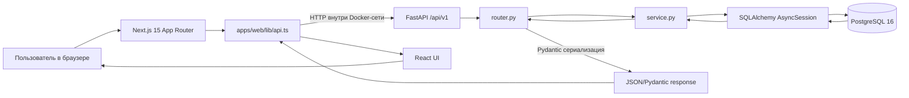
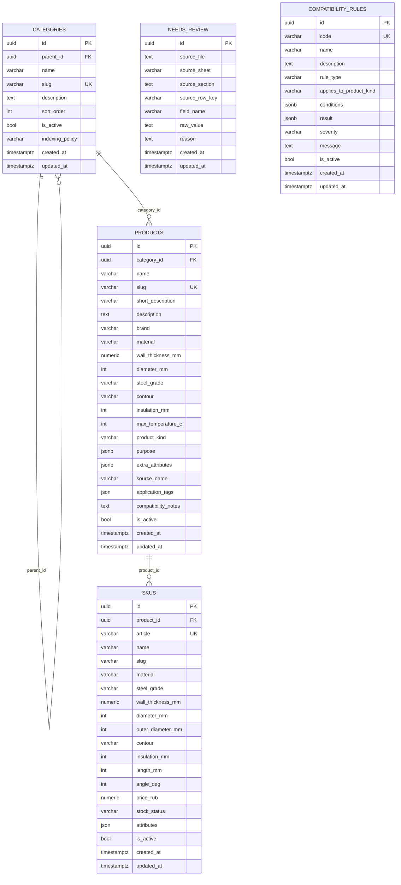

# Дымоходы: устройство проекта и руководство владельца

> Актуальность аудита: 25 июля 2026 года.  
> Руководство описывает фактический код текущего репозитория. Целевые идеи из проектных
> документов помечены отдельно и не выдаются за реализованные функции.

## Как читать это руководство

Пути в обратных кавычках ведут к файлам репозитория. Рядом с путём обычно указаны конкретный
класс или функция, на которых основано объяснение. Если функция описана в проектных планах, но
отсутствует в рабочем коде, это прямо отмечено словами **«не реализовано»**.

Главные источники текущего состояния:

- `PROJECT_CONTEXT.md` — короткая сводка о продукте и загруженных данных;
- `NEXT_STEPS.md` — ближайшие, но ещё не обязательно реализованные этапы;
- `README.md` — команды запуска;
- `PRODUCT_VARIANT_SEO_ARCHITECTURE.md` — целевая модель Product → Variant/SKU и SEO;
- `backend/configurator/CONFIGURATOR_RULES.md` — целевые правила будущего расчёта;
- рабочий код в `backend/app/` и `apps/web/`;
- фактическая история схемы в `backend/alembic/versions/`.

Документы с формулировками «должен», «целевой endpoint» и «следующий этап» описывают намерение.
Источником истины о том, что уже работает, являются маршруты, функции, модели и миграции.

---

## 1. Что это за система

### 1.1. Назначение

Dimohod Trade — MVP платформы подбора и продажи элементов дымохода. Идея продукта шире обычного
интернет-магазина: пользователь должен получить совместимый комплект от патрубка печи или котла
до оголовка, а не случайный набор труб. Этот принцип зафиксирован в `PROJECT_CONTEXT.md`.

Сейчас фактически работают следующие части:

1. Публичная витрина на Next.js:
   - главная — `apps/web/app/page.tsx`, компонент `HomePage`;
   - каталог — `apps/web/app/catalog/page.tsx`, компонент `CatalogPage`;
   - карточка товара — `apps/web/app/product/[slug]/page.tsx`, компонент `ProductPage`;
   - интерактивный демонстрационный конфигуратор — функция-компонент
     `ChimneyConfigurator` в `apps/web/components/ChimneyConfigurator.tsx`.
2. FastAPI API:
   - проверка состояния;
   - дерево категорий;
   - список товаров и фильтры;
   - карточка товара со всеми SKU;
   - выдача и проверка правил совместимости.
   Маршруты собраны в `backend/app/api/v1/router.py`, объект `api_router`.
3. PostgreSQL-каталог:
   - категории;
   - логические товары;
   - варианты/SKU;
   - журнал неоднозначностей импорта;
   - правила совместимости.
4. Импорт прайс-листов из заранее подготовленного JSON:
   `backend/app/db/import_price_list.py`, функция `import_price_list`.
5. Telegram-интеграция для постановки задач Codex, отправки файлов/изображений и подтверждаемого
   release-процесса: `tools/codex_telegram_bot/bot.py`.

### 1.2. Основные пользовательские сценарии

- Посетитель открывает каталог и фильтрует логические товары по `product_kind`.
- Посетитель открывает карточку логического Product и выбирает один из его SKU.
- Карточка показывает сообщения правил совместимости для выбранного SKU.
- На главной посетитель меняет параметры демонстрационной трассы и видит схему и примерный BOM.
- Оператор импортирует подготовленный JSON-прайс в PostgreSQL.
- Владелец управляет изменениями проекта через Telegram-бота и отдельно подтверждает release.

### 1.3. Что важно не перепутать

Конфигуратор на главной **не является серверным расчётом комплекта**. Функции
`buildCeilingScene` и `buildWallScene` в
`apps/web/components/ChimneyConfigurator.tsx` формируют BOM локально в браузере из
фиксированных названий и размеров. Они:

- не вызывают FastAPI;
- не выбирают реальные SKU;
- не читают цены;
- не сохраняют проект расчёта;
- не применяют строки из таблицы `compatibility_rules`;
- используют демонстрационные значения вроде `Ø115/200`.

Endpoint-ы `POST /api/v1/configurator/projects` и
`POST /api/v1/configurator/projects/{id}/calculate`, таблицы проектов расчёта и полноценный
серверный BOM — **не реализовано**. Они перечислены как следующий этап в `NEXT_STEPS.md`.

---

## 2. Карта проекта

```text
.
├── apps/web/                              # Next.js-витрина
│   ├── app/
│   │   ├── layout.tsx                     # общая HTML-оболочка и шапка
│   │   ├── page.tsx                       # главная страница
│   │   ├── page.module.css                # стили главной
│   │   ├── globals.css                    # общие стили каталога, карточки, конфигуратора
│   │   ├── catalog/page.tsx               # каталог и фильтр product_kind
│   │   └── product/[slug]/page.tsx        # серверная страница карточки
│   ├── components/
│   │   ├── ProductExperience.tsx          # клиентская карточка и выбор SKU
│   │   ├── ChimneyConfigurator.tsx        # демонстрационная схема и локальный BOM
│   │   └── ScenarioCard.tsx               # небольшой презентационный компонент
│   ├── lib/api.ts                         # типы DTO и server-side HTTP-клиент FastAPI
│   ├── public/images/                     # статические изображения frontend
│   ├── next.config.ts                     # basePath и настройки Next.js
│   ├── package.json                       # frontend-зависимости и команды
│   └── Dockerfile                         # сборка и запуск Next.js
├── backend/
│   ├── app/
│   │   ├── main.py                        # создание FastAPI-приложения и CORS
│   │   ├── api/v1/router.py               # корневой роутер /api/v1
│   │   ├── core/config.py                 # Settings из окружения
│   │   ├── db/
│   │   │   ├── base.py                    # SQLAlchemy Base и TimestampMixin
│   │   │   ├── session.py                 # engine, AsyncSessionLocal, get_db
│   │   │   ├── models.py                  # импорт всех ORM-моделей для Alembic
│   │   │   ├── seed.py                    # небольшие demo-данные
│   │   │   ├── import_price_list.py       # JSON → Category/Product/SKU
│   │   │   ├── group_products_into_variants.py
│   │   │   │                                # миграция legacy Product в logical Product + SKU
│   │   │   └── seed_compatibility_rules.py # начальные правила совместимости
│   │   └── modules/
│   │       ├── catalog/                    # Category, схемы, service, router
│   │       ├── products/                   # Product/SKU/NeedsReview и API товаров
│   │       └── compatibility/              # правило, evaluator и API проверки
│   ├── alembic/
│   │   ├── env.py                          # подключение metadata и запуск миграций
│   │   └── versions/                       # четыре последовательные миграции
│   ├── configurator/CONFIGURATOR_RULES.md  # проектные правила, не весь текст реализован
│   ├── tests/test_health.py                # единственный backend API-тест
│   ├── pyproject.toml                      # Python-зависимости
│   └── Dockerfile                          # миграции + Uvicorn при старте
├── storage/                                # локальные demo-медиа и чертежи
├── prices/                                 # исходные прайсы/JSON, не код приложения
├── tools/codex_telegram_bot/
│   ├── bot.py                              # Telegram, OpenAI, Codex, release workflow
│   ├── test_bot.py                         # unit-тесты бота
│   └── README.md                           # установка и команды бота
├── deploy/dimohod-codex-bot.service        # systemd-unit Telegram-бота
├── compose.yaml                            # postgres, redis, backend, web
├── .env.example                            # только имена и примеры переменных
├── README.md                               # локальный запуск
├── PROJECT_CONTEXT.md                      # текущее состояние продукта
└── NEXT_STEPS.md                           # план ближайшей разработки
```

`AGENTS.md` в репозитории отсутствует.

### Слои backend

Каждый из трёх бизнес-модулей примерно разделён на четыре файла:

- `models.py` — ORM-модель таблицы;
- `schemas.py` — входные и выходные Pydantic-модели;
- `service.py` — запросы и бизнес-логика;
- `router.py` — HTTP endpoint-ы и преобразование ошибок в HTTP-ответ.

Отдельного слоя `repositories` нет — **не реализовано**. SQLAlchemy-запросы находятся прямо в
`service.py`, а импортирующие скрипты работают с ORM напрямую.

---

## 3. Архитектура целиком

### 3.1. Реальная схема выполнения



Основание схемы:

- Next.js вызывает backend через `getCatalogTree`, `getProducts`,
  `getProductFilters` и `getProduct` в `apps/web/lib/api.ts`.
- `API_BASE_URL` по умолчанию указывает на `http://localhost:8000`, а в Compose —
  на `http://backend:8000`; см. `apps/web/lib/api.ts` и `compose.yaml`.
- FastAPI создаётся функцией `create_app` в `backend/app/main.py`.
- Все API подключены с префиксом `/api/v1` в `backend/app/api/v1/router.py`.
- Сессия передаётся через dependency `get_db` из `backend/app/db/session.py`.

### 3.2. Что делает Next.js

Каталог и страница товара — серверные компоненты. Они запрашивают FastAPI на стороне Next.js,
а не напрямую из браузера:

- `CatalogPage` вызывает три функции API параллельно через `Promise.all`;
- `ProductPage` вызывает `getProduct(slug)`;
- fetch-клиент использует `next: { revalidate: 60 }`, поэтому ответ может кэшироваться на
  60 секунд.

`ProductExperience` и `ChimneyConfigurator` помечены `"use client"`: выбор SKU, FAQ, слайдеры и
перерисовка схемы выполняются уже в браузере.

### 3.3. Что делает FastAPI

`create_app` настраивает:

- заголовок и версию API;
- Swagger UI по `/api/docs`;
- OpenAPI по `/api/openapi.json`;
- CORS из `Settings.backend_cors_origins`;
- роутер `/api/v1`.

Глобальной обработки доменных ошибок, request ID, метрик и структурированного логирования нет —
**не реализовано**. Используются стандартные ответы FastAPI и точечные `HTTPException` в
`products/router.py` и `compatibility/router.py`.

### 3.4. Redis

Redis объявлен в `compose.yaml`, его URL читается классом `Settings` в
`backend/app/core/config.py`, а контейнер участвует в проверке готовности. При этом ни один
рабочий модуль не создаёт Redis-клиент и не читает/записывает данные — прикладное использование
Redis **не реализовано**.

---

## 4. Как проходит один реальный запрос

Рассмотрим реальный сценарий: пользователь открывает
`/catalog?product_kind=отвод&page=1`.

### 4.1. Шаги по коду

1. Next.js вызывает `CatalogPage` из `apps/web/app/catalog/page.tsx`.
2. Компонент читает `searchParams`, вычисляет `limit=48`, `offset=0` и
   `productKind="отвод"`.
3. Через `Promise.all` запускаются:
   - `getCatalogTree`;
   - `getProductFilters`;
   - `getProducts`.
   Все функции находятся в `apps/web/lib/api.ts`.
4. `getProducts` выполняет:
   `GET /api/v1/products?limit=48&offset=0&product_kind=отвод`.
5. FastAPI направляет запрос в `read_products` из
   `backend/app/modules/products/router.py`.
6. FastAPI валидирует query-параметры декларациями `Query`:
   - `limit` от 1 до 96;
   - `offset` не меньше 0;
   - строка `product_kind` длиной от 1 до 64.
7. Dependency `get_db` из `backend/app/db/session.py` открывает `AsyncSession`.
8. `read_products` вызывает `list_products` из
   `backend/app/modules/products/service.py`.
9. `list_products` выполняет два SQL-запроса:
   - `count(products.id)` с условиями `is_active = true` и
     `product_kind = 'отвод'`;
   - выборку страницы `products`, сортируя тип, диаметр и имя.
10. Опции загрузки:
    - `joinedload(Product.category)` присоединяет категорию;
    - `selectinload(Product.skus)` отдельным пакетным запросом загружает SKU всех выбранных
      Product.
11. `read_products` оставляет только активные SKU, находит минимальную цену и представительный
    SKU, затем создаёт `ProductListItem`.
12. Pydantic-модели `ProductListItem` и `ProductListResponse` из
    `backend/app/modules/products/schemas.py` формируют JSON.
13. `getProducts` типизирует JSON как `ProductListResponse`.
14. `CatalogPage` строит карточки функцией-компонентом `ProductCard`.

### 4.2. Sequence diagram

```mermaid
sequenceDiagram
    actor User as Пользователь
    participant Page as CatalogPage
    participant Client as getProducts()
    participant API as read_products()
    participant Service as list_products()
    participant Session as AsyncSession
    participant DB as PostgreSQL

    User->>Page: GET /catalog?product_kind=отвод
    Page->>Client: getProducts(limit=48, offset=0, productKind="отвод")
    Client->>API: GET /api/v1/products?...product_kind=отвод
    API->>Session: Depends(get_db)
    API->>Service: list_products(session, ...)
    Service->>DB: SELECT count(products.id) WHERE ...
    DB-->>Service: total
    Service->>DB: SELECT products + category; SELECT skus WHERE product_id IN (...)
    DB-->>Service: Product ORM objects
    Service-->>API: products, total
    API->>API: min(price), representative SKU, ProductListItem
    API-->>Client: ProductListResponse JSON
    Client-->>Page: typed data
    Page-->>User: HTML каталога и карточки
```

### 4.3. Где здесь Pydantic

Для этого GET-запроса отдельной Pydantic request-схемы нет: query-параметры валидирует FastAPI
через `Query`. Ответ проверяется схемами:

- `CategorySummary`;
- `ProductListItem`;
- `ProductListResponse`.

Все они находятся в `backend/app/modules/products/schemas.py`.

### 4.4. Как проходит запрос карточки товара

Короткая дополнительная трасса:

`ProductPage` → `getProduct` → `GET /api/v1/products/{slug}` → `read_product` →
`get_product_by_slug` → PostgreSQL.

`get_product_by_slug` загружает Category и **все** SKU товара. После этого `read_product`
один раз получает все активные правила функцией `list_active_rules` и для каждого SKU вызывает
`evaluate_rules(context_from_product_sku(...))`. Результат возвращается как
`ProductRead`, где каждый `SKURead` содержит `compatibility_messages`.

Это реальная логика, но она плохо масштабируется для товара с 1 500+ SKU: endpoint передаёт весь
массив и вычисляет правила для каждого варианта. Пагинация/выбор sibling-вариантов —
**не реализовано**.

---

## 5. База данных для новичка

### 5.1. PostgreSQL

PostgreSQL — отдельный сервер, который надёжно хранит структурированные данные. В этом проекте
он запущен контейнером `postgres:16-alpine` из `compose.yaml`. Данные переживают перезапуск
контейнера благодаря volume `postgres_data`.

### 5.2. Таблица, строка и колонка

Таблица похожа на лист с жёстко заданными колонками:

- таблица `products` хранит логические товары;
- одна строка `products` может означать «Сэндвич-труба»;
- колонка `slug` хранит URL-идентификатор;
- колонка `product_kind` хранит тип изделия;
- колонка `is_active` управляет видимостью.

Определение: `backend/app/modules/products/models.py`, класс `Product`.

Конкретные диаметры, длины и цены принадлежат строкам `skus`, класс `SKU` в том же файле.

### 5.3. Primary key

Primary key однозначно идентифицирует строку. Во всех пяти таблицах это UUID-колонка `id`.
Например, `Product.id` объявлен в `backend/app/modules/products/models.py`.

UUID генерируется Python-функцией `uuid.uuid4` при создании ORM-объекта. Если вставлять строку
напрямую SQL-командой без `id`, серверного default для UUID в миграциях нет.

### 5.4. Foreign key

Foreign key не позволяет ссылаться на несуществующую строку:

- `products.category_id → categories.id`;
- `skus.product_id → products.id`;
- `categories.parent_id → categories.id`.

При удалении Product его SKU удаляются через `ON DELETE CASCADE`. Удаление Category с Product
запрещено через `ON DELETE RESTRICT`. При удалении родительской Category у дочерней категории
`parent_id` становится `NULL` благодаря `ON DELETE SET NULL`.

Источник: первая миграция
`backend/alembic/versions/202607160001_initial_catalog.py`, функция `upgrade`.

### 5.5. Unique constraint

Unique constraint запрещает дубли:

- `categories.slug`;
- `products.slug`;
- `skus.article`;
- пара `skus(product_id, slug)`;
- `compatibility_rules.code`.

Последние два ограничения добавлены миграциями
`202607200002_sku_variant_fields.py` и `202607200003_compatibility_rules.py`.

Важно: `SKU.slug` допускает `NULL`. PostgreSQL разрешает несколько строк с `NULL` под обычным
unique constraint, поэтому старые SKU без slug могут сосуществовать.

### 5.6. Индекс

Индекс ускоряет поиск ценой дополнительного места и работы при записи. В проекте есть явные
индексы на:

- `categories.parent_id`;
- `products.category_id`;
- `skus.product_id`;
- `skus.slug`;
- `needs_review.source_file`;
- `needs_review.field_name`;
- `compatibility_rules.code`;
- `compatibility_rules.applies_to_product_kind`.

Unique constraints PostgreSQL также поддерживает внутренними уникальными индексами.

### 5.7. Транзакция

Транзакция объединяет изменения по правилу «либо всё, либо ничего».

Реальный пример — `import_price_list`:

- открывает одну `AsyncSession`;
- удаляет прежние записи `NeedsReview` для файла и листа;
- создаёт/обновляет категории, Product и SKU;
- вызывает `await session.commit()` только после обработки всего листа.

Если до commit возникает необработанное исключение, контекст сессии закрывается без commit, и
незавершённая транзакция откатывается драйвером.

`group_products_into_variants` делает `commit`, а в режиме `--dry-run` вызывает `rollback`.

### 5.8. One-to-many

One-to-many означает «одна строка слева — много строк справа»:

- одна Category → много Product;
- один Product → много SKU;
- одна Category-родитель → много дочерних Category.

ORM-связи `Category.products`, `Product.skus`, `Category.children` описаны в
`catalog/models.py` и `products/models.py`.

### 5.9. Many-to-many

Many-to-many требует промежуточной таблицы: например, много товаров могут иметь много документов.
В текущей схеме ни одной такой связи и промежуточной таблицы нет — **не реализовано**.
`purpose`, `application_tags` и `attributes` пока хранятся как JSON/JSONB, а не как нормализованные
many-to-many-связи.

---

## 6. Фактическая схема базы данных



`NEEDS_REVIEW` и `COMPATIBILITY_RULES` сейчас не имеют foreign key к каталогу, поэтому на
ER-диаграмме они стоят отдельно.

### 6.1. `categories`

Назначение: иерархия разделов каталога.

Модель: `Category` в `backend/app/modules/catalog/models.py`.

Особенности:

- self-reference через `parent_id`;
- уникальный `slug`;
- сортировка через `sort_order`;
- API возвращает только `is_active=true`;
- дерево собирается в памяти функцией `get_catalog_tree` после одного SQL-запроса.

### 6.2. `products`

Назначение: логический тип изделия, объединяющий варианты.

Модель: `Product` в `backend/app/modules/products/models.py`.

`Product` сейчас всё ещё содержит некоторые поля, которые могут относиться к варианту
(`diameter_mm`, `steel_grade`, `wall_thickness_mm`). Скрипт
`group_products_into_variants` очищает эти поля у логического Product и переносит конкретику в
SKU, но схема сохраняет оба уровня для совместимости со старыми данными.

### 6.3. `skus`

Назначение: конкретная покупаемая позиция/Variant.

Модель: `SKU` в `backend/app/modules/products/models.py`.

Здесь находятся артикул, variant slug, размеры, материал, цена, наличие и JSON `attributes`.
Пара `(product_id, slug)` уникальна. Один Product может иметь большое число SKU.

### 6.4. `needs_review`

Назначение: не угадывать данные при неоднозначном импорте, а сохранить причину ручной проверки.

Модель: `NeedsReview` в `backend/app/modules/products/models.py`.

Функция `log_review` из `backend/app/db/import_price_list.py` создаёт записи, если не удалось
определить тип товара или распарсить диаметр. Таблица не имеет API и административного интерфейса —
просмотр/обработка очереди **не реализовано**.

### 6.5. `compatibility_rules`

Назначение: хранить условия и сообщения правил в JSONB.

Модель: `CompatibilityRule` в `backend/app/modules/compatibility/models.py`.

`evaluate_rules` из `compatibility/service.py` сопоставляет контекст с операторами `eq`, `neq`,
`in`, `not_in`, `is_null`, `is_not_null`, `eq_field`, `neq_field` и возвращает сообщения.

Поле `result` сохраняется и выдаётся endpoint-ом `/rules`, но `evaluate_rules` не применяет его
к выбору SKU или построению BOM. Следовательно, правила сейчас информируют/предупреждают, но не
являются полноценным движком расчёта.

### 6.6. Категории, семейства, продукты, варианты и SKU

- Category — реальная таблица `categories`.
- Logical Product/семейство изделия — реальная строка `products`.
- Variant и SKU — в текущем коде одно и то же: строка `skus`.
- Отдельной таблицы `families`, `templates` или `product_variants` нет.
- Отдельной таблицы характеристик и справочника значений нет; структурированные поля находятся
  в Product/SKU, расширяемые — в JSON.

### 6.7. Изображения

Таблиц изображений и связей Product → Media нет — **не реализовано**.

Фактическое хранение:

- `apps/web/public/images/home/` — фон и карточки главной;
- `apps/web/public/images/configurator/` — PNG-детали схемы;
- `storage/catalog/products/.../photos/` — три demo-изображения товара;
- `tempProductMedia` в `apps/web/components/ProductExperience.tsx` — временная жёстко
  прописанная карта slug → URL.

Загрузка через API, проверка типа/размера файла, объектное хранилище и миграция медиа —
**не реализовано**. Конфигурация reverse proxy для URL `/dimohod-media/...` также отсутствует в
репозитории, поэтому её поведение определяется внешней инфраструктурой.

### 6.8. BOM

Таблиц BOM, состава изделия или проекта расчёта нет — **не реализовано**.

Типы `BomType` и `BomItem`, а также функции `pushBom`, `buildCeilingScene` и `buildWallScene`
существуют только во frontend-файле `ChimneyConfigurator.tsx`. После обновления страницы такой
расчёт теряется.

### 6.9. Правила совместимости

Правила существуют в `compatibility_rules` и загружаются скриптом
`seed_compatibility_rules.py`, список `DEFAULT_RULES`. Реализовано 11 начальных правил.

Нет:

- внешнего ключа правила к Product/SKU;
- версии правил и истории изменений;
- Pydantic-валидации структуры `conditions`/`result`;
- базы проверенных инженерных нормативов;
- серверного выбора SKU по результату правила.

---

## 7. SQLAlchemy

### 7.1. Зачем он нужен

SQLAlchemy переводит Python-объекты и выражения `select(...)` в SQL PostgreSQL. Благодаря ему
service-функции работают с `Product`, `SKU`, `Category`, а не собирают строки SQL вручную.

Проект использует асинхронный SQLAlchemy 2 через драйвер `asyncpg`; зависимости указаны в
`backend/pyproject.toml`.

### 7.2. Подключение к базе

`backend/app/db/session.py`:

- `create_async_engine(settings.database_url, pool_pre_ping=True)` создаёт engine;
- `pool_pre_ping` проверяет соединение перед использованием;
- `AsyncSessionLocal = async_sessionmaker(..., expire_on_commit=False)` создаёт фабрику сессий;
- `get_db` выдаёт одну сессию на FastAPI-запрос.

URL берётся классом `Settings` из `backend/app/core/config.py`. Реальные значения окружения в
документе намеренно не приводятся.

### 7.3. Где объявлен Base

`Base` находится в `backend/app/db/base.py` и наследуется от `DeclarativeBase`.
Там же задан naming convention для имён ограничений и `TimestampMixin` с `created_at` и
`updated_at`.

`backend/app/db/models.py` импортирует все ORM-модели, чтобы Alembic увидел их в
`Base.metadata`.

### 7.4. Как описаны модели

Используется современный типизированный стиль:

```python
id: Mapped[uuid.UUID] = mapped_column(...)
```

Колонки объявляются через `mapped_column`, связи — через `relationship`. Модели разделены по
модулям:

- `Category`;
- `Product`, `SKU`, `NeedsReview`;
- `CompatibilityRule`.

### 7.5. Что такое Session

`AsyncSession` — рабочий контекст общения с БД. Он:

- выполняет запросы;
- отслеживает изменённые ORM-объекты;
- делает `flush`, чтобы отправить изменения без завершения транзакции;
- делает `commit` или `rollback`.

В HTTP read-endpoint-ах сессия только читает данные. Автоматического commit в `get_db` нет.
Это нормально для текущих GET и вычислительного POST `/compatibility/check`, потому что они не
изменяют БД. При появлении записывающих API потребуется явно определить границу транзакции.

### 7.6. Select

Примеры:

- дерево категорий — `get_catalog_tree`;
- список товаров — `list_products`;
- карточка — `get_product_by_slug`;
- правила — `list_active_rules`;
- контекст SKU — `get_sku_context`.

Типичный шаблон:

```python
result = await session.execute(select(Product).where(...))
products = list(result.scalars())
```

### 7.7. Insert

Специального HTTP endpoint для создания товара нет — **не реализовано**.

Вставки выполняют служебные скрипты:

- `seed` создаёт Category/Product/SKU;
- `import_price_list` создаёт Product/SKU и записи NeedsReview;
- `seed_compatibility_rules` создаёт CompatibilityRule.

Объект добавляется через `session.add(...)`, после чего `flush` может получить сгенерированный
UUID до commit.

### 7.8. Update

`import_price_list` ищет Product по slug и SKU по article, затем присваивает новые значения
полям ORM-объекта. `seed_compatibility_rules` обновляет существующее правило по `code`.
`group_products_into_variants` переносит SKU к каноническому Product и выключает legacy Product.

Публичного API update — **не реализовано**.

### 7.9. Delete

Публичного API delete — **не реализовано**.

Реальный delete есть в начале `import_price_list`: старые `NeedsReview` текущего файла/листа
удаляются выражением `delete(NeedsReview).where(...)`.

На уровне схемы удаление Product каскадно удаляет SKU, а ORM-связь `Product.skus` дополнительно
имеет `cascade="all, delete-orphan"`.

### 7.10. Relationship и стратегии загрузки

- `Category.parent/children` — самоссылочная иерархия;
- `Category.products ↔ Product.category`;
- `Product.skus ↔ SKU.product`.

В API товаров отношения загружаются явно:

- `joinedload(Product.category)` — Category приходит через JOIN;
- `selectinload(Product.skus)` — все SKU страницы приходят одним дополнительным запросом по
  списку `product_id`.

Это защищает каталог от классического N+1.

### 7.11. Где возможны N+1 и лишние запросы

1. `import_price_list` внутри каждой ценовой строки отдельно ищет Product по slug и SKU по
   article. На большом прайсе это тысячи последовательных запросов.
2. `unique_product_slug` в `group_products_into_variants.py` делает новый SELECT для каждой
   попытки подобрать slug.
3. Карточка Product не создаёт N+1 при загрузке SKU, но загружает **все** SKU и затем вычисляет
   правила в Python для каждого. Это проблема объёма ответа и CPU.
4. `list_products` загружает все SKU для 48 Product только ради минимальной цены, количества и
   нескольких полей. Агрегирующий SQL-запрос был бы дешевле.

### 7.12. Где заканчивается транзакция

- FastAPI `get_db`: сессия закрывается после запроса; явного commit нет.
- `seed`, `seed_compatibility_rules`, `import_price_list`: один commit в конце операции.
- `group_products_into_variants`: commit в рабочем режиме, rollback в `--dry-run`.
- Alembic: `context.begin_transaction()` оборачивает выполнение миграций.

---

## 8. Alembic и эволюция схемы

Alembic хранит последовательность изменений БД, чтобы окружения получили одинаковую схему.
`backend/alembic/env.py` подставляет текущий `database_url`, импортирует ORM metadata и умеет
работать online/offline.

Цепочка миграций линейная:

1. `202607160001_initial_catalog.py` — `categories`, `products`, `skus`.
2. `202607170001_product_import_fields.py` — поля импорта Product и `needs_review`.
3. `202607200002_sku_variant_fields.py` — variant-поля SKU и уникальная пара
   `(product_id, slug)`.
4. `202607200003_compatibility_rules.py` — таблица правил.

Backend-контейнер при каждом запуске выполняет `alembic upgrade head`, затем запускает Uvicorn;
см. `backend/Dockerfile`.

Технический долг:

- миграции не содержат check constraints для `severity`, `contour`, положительных размеров и
  цены;
- `updated_at` имеет server default, но не имеет DB-trigger: автоматический `onupdate` работает
  через ORM, а прямой SQL может не обновить дату;
- `compatibility_rules.code` имеет и unique constraint, и отдельный индекс, что может быть
  избыточно;
- нет интеграционного теста `upgrade`/`downgrade` на чистой PostgreSQL.

---

## 9. API и Pydantic-схемы

### 9.1. Реализованные endpoint-ы

| Метод и путь | Обработчик | Назначение |
|---|---|---|
| `GET /api/v1/health` | `api/v1/router.py: health` | проверка процесса API |
| `GET /api/v1/catalog/tree` | `catalog/router.py: read_catalog_tree` | активное дерево категорий |
| `GET /api/v1/products` | `products/router.py: read_products` | страница товаров |
| `GET /api/v1/products/filters` | `products/router.py: read_product_filters` | значения `product_kind` |
| `GET /api/v1/products/{slug}` | `products/router.py: read_product` | Product, SKU и сообщения |
| `GET /api/v1/compatibility/rules` | `compatibility/router.py: read_compatibility_rules` | активные правила |
| `POST /api/v1/compatibility/check` | `compatibility/router.py: check_compatibility` | проверка контекста/SKU |

`POST /compatibility/check` ничего не сохраняет. Он принимает
`CompatibilityCheckRequest`, при необходимости дополняет контекст данными SKU и возвращает
`CompatibilityCheckResponse`.

### 9.2. Не реализовано

- CRUD категорий, товаров и SKU;
- корзина, заказ, оплата и заявка;
- поиск;
- аккаунт пользователя;
- серверный конфигуратор и сохранение проекта;
- endpoint конкретного Variant по `product_slug + variant_slug`;
- API медиа и документов;
- API обработки `needs_review`;
- админка.

### 9.3. Риск схем правил

`conditions` и `result` типизированы как `dict[str, Any]`. Неизвестный оператор внутри условия
не отклоняется отдельной схемой. В `matches_expected` он может фактически пройти как совпадение,
если ни одна известная проверка не вернула `False`. Нужны строгие Pydantic-модели или JSON Schema
для языка правил.

`CompatibilityCheckRequest.extra_context` задан как `{}`. Pydantic обычно копирует значения
моделей, но явный `Field(default_factory=dict)` был бы безопаснее и понятнее.

---

## 10. Каталог, импорт и модель Product → SKU

### 10.1. Импорт

`import_price_list` читает не Excel напрямую, а JSON с листами и блоками. Он:

- распознаёт материал и толщину функцией `parse_section`;
- определяет `product_kind`;
- разбирает внутренний/наружный диаметр;
- создаёт корневые и дочерние категории;
- находит/создаёт логический Product по slug;
- находит/создаёт SKU по article;
- сохраняет исходные признаки в JSON;
- неоднозначные строки отправляет в `needs_review`;
- делает commit после всего листа.

Это upsert-подобная логика, но она не использует PostgreSQL `ON CONFLICT` и выполняет много
последовательных SELECT.

### 10.2. Legacy-группировка

`group_products_into_variants` был создан для перехода от «один Product на позицию прайса» к
«один логический Product — много SKU». Функция:

- строит `logical_key`;
- выбирает первый Product каноническим;
- формирует variant slug;
- переносит SKU;
- выключает объединённые legacy Product;
- сохраняет служебные признаки в `extra_attributes`.

Документированное состояние количества строк находится в `PROJECT_CONTEXT.md`; это снимок
данных на указанную там дату, а не динамический запрос при генерации этого руководства.

### 10.3. Фильтры вариантов и наружный кожух

Карточка товара и категория используют одинаковую компактную модель выбора, но остаются разными
компонентами: карточка выбирает конкретный SKU семейства, категория формирует поисковый запрос.
Backend возвращает составные варианты внутренней и наружной трубы и матрицу сочетаний активных SKU.

Для внутренней оцинковки подтверждены два наружных исполнения: оцинковка и нержавеющая сталь
AISI 430 толщиной 0,5 мм. Марки AISI 304/321/316 с внутренней оцинковкой не подтверждены. Поля марки
и толщины внутренней трубы скрываются, потому что этих значений нет в заголовке секции прайса;
выбор наружного кожуха при этом остаётся доступным.

Подробная контрольная точка интерфейса, выбора SKU и миграций зафиксирована в
`docs/PROGRESS_2026-08-05.md`.

---

## 11. Аутентификация и роли

У публичного Next.js/FastAPI-приложения аутентификация и роли **не реализованы**:

- нет User/Role/Permission моделей;
- нет login/logout endpoint-ов;
- нет JWT, cookie-session или OAuth;
- API каталога и правил открыт без авторизации.

Telegram-бот имеет отдельный механизм доступа:

- `StateStore.claim` закрепляет первого разрешённого пользователя либо использует allowlist;
- `StateStore.is_authorized` проверяет Telegram user ID;
- `safe_project_file` блокирует выход за каталог проекта;
- `ReleaseManager` исключает защищённые пути и требует подтверждения release.

Это защита инструмента разработки, а не аутентификация покупателей сайта.

---

## 12. Изображения, документы и внешние интеграции

### 12.1. Изображения и документы товара

Карточка `ProductExperience` содержит:

- временный словарь `tempProductMedia`;
- статический массив `docs`;
- кнопки документов без URL и скачивания.

Документы в БД, привязки к SKU и реальные download endpoint-ы — **не реализовано**.

### 12.2. Telegram и OpenAI

`tools/codex_telegram_bot/bot.py` интегрируется с:

- Telegram Bot API;
- локальным Codex CLI;
- OpenAI API для распознавания голоса, анализа фото и генерации изображений;
- локальным Git и Docker через подтверждаемый host-side release workflow.

Секреты читаются из окружения. Их значения не должны попадать в Git, логи или документацию.

### 12.3. Другие интеграции

ERP, CRM, платёжная система, доставка, маркетплейсы, email-провайдер и аналитика —
**не реализовано**. Телефонные и email-ссылки на frontend статические.

---

## 13. Конфигурация, Docker и деплой

### 13.1. Окружение

`Settings` читает:

- имя и версию приложения;
- URL PostgreSQL;
- URL Redis;
- список CORS origins.

Next.js использует:

- `API_BASE_URL`;
- `NEXT_PUBLIC_APP_URL`;
- `NEXT_BASE_PATH`.

Пример имён переменных находится в `.env.example`. Файл `.env` исключён через `.gitignore`.

### 13.2. Compose

`compose.yaml` поднимает:

- `postgres`;
- `redis`;
- `backend`;
- `web`.

Backend зависит от успешных healthcheck PostgreSQL и Redis. Web зависит от backend, но обычный
`depends_on` не гарантирует готовность HTTP API.

### 13.3. Frontend base path

Production работает под `/dimohod`; это задаётся `NEXT_BASE_PATH` и читается в
`apps/web/next.config.ts`. Главная дополнительно добавляет base path к изображениям функцией
`assetUrl`.

### 13.4. Деплой

В репозитории есть:

- Docker Compose для сборки/запуска;
- systemd-unit Telegram-бота;
- `ReleaseManager` с тестами, commit/push и `docker compose up -d --build`.

Конфигурация Nginx/Caddy, TLS, DNS, резервного копирования PostgreSQL, миграционного rollback и
production-monitoring отсутствует — **не реализовано в этом репозитории**.

---

## 14. Тесты, логи и ошибки

### 14.1. Тесты

Backend:

- `backend/tests/test_health.py` проверяет только `/api/v1/health`.

Telegram:

- `tools/codex_telegram_bot/test_bot.py` проверяет разбиение сообщений, безопасную отправку
  файлов, доступ пользователей, распознавание release-команд и защиту путей.

Frontend-тестов, DB-интеграционных тестов и тестов catalog/products/compatibility нет.

Наиболее важные недостающие проверки:

- миграции на чистой PostgreSQL;
- список/карточка товара с реальными отношениями;
- все операторы rule evaluator;
- импорт с rollback и повторным запуском;
- уникальность variant slug;
- большие Product с тысячами SKU;
- браузерные сценарии каталога и конфигуратора.

### 14.2. Логи

Отдельной настройки прикладного логирования FastAPI нет. Uvicorn и Alembic используют стандартный
вывод. Нет:

- JSON-логов;
- correlation/request ID;
- централизованного хранилища логов;
- Sentry/OpenTelemetry;
- метрик и alerting.

### 14.3. Обработка ошибок

- `read_product` и `check_compatibility` возвращают 404 через `HTTPException`.
- `CatalogPage` ловит любую ошибку API и показывает общий текст, но не логирует причину.
- `getProduct` отдельно распознаёт 404, остальные ошибки превращает в общий `Error`.
- Импорт в основном полагается на исключение и откат незавершённой транзакции.

Единого формата бизнес-ошибок нет.

---

## 15. Технический долг и опасные зависимости

### Критичные границы MVP

1. Визуальный BOM живёт отдельно от backend-правил и реального каталога.
2. Правила возвращают сообщения, но поле `result` не управляет выбором SKU.
3. Карточка загружает все SKU; известны Product с более чем тысячей вариантов.
4. Медиа и документы жёстко прописаны во frontend и не являются данными PostgreSQL.
5. Нет аутентификации и разграничения доступа к будущим записывающим API.

### Целостность данных

1. Нет check constraints для цены, размеров, `severity`, `contour`, `stock_status`.
2. JSON/JSONB позволяют сохранить произвольную структуру без строгой схемы.
3. `needs_review` не связан foreign key с импортированной сущностью.
4. UUID имеет Python default, но не server default.
5. `updated_at` не защищён DB-trigger.

### Производительность

1. Импорт выполняет SELECT на каждую позицию.
2. Список Product загружает все SKU страницы ради агрегатов.
3. Карточка сериализует и проверяет все SKU.
4. Нет server-side endpoint-а опций/соседних вариантов.

### Инфраструктура

1. Redis запущен, но не используется.
2. Нет healthcheck web/backend в Compose.
3. Нет описанного backup/restore PostgreSQL.
4. Нет конфигурации reverse proxy и наблюдаемости в репозитории.
5. Backend image устанавливает dev-зависимости, включая тестовые, в runtime.

### Документация против реализации

`PRODUCT_VARIANT_SEO_ARCHITECTURE.md`, `NEXT_STEPS.md` и
`CONFIGURATOR_RULES.md` содержат целевые endpoint-ы и таблицы. Перед планированием задачи всегда
нужно проверять наличие реального router/model/migration, иначе будущая функция может быть
ошибочно принята за готовую.

---

## 16. Безопасный порядок дальнейшей разработки

Порядок согласуется с `NEXT_STEPS.md`, но сформулирован через реальные пробелы:

1. Зафиксировать строгую входную схему проекта трассы и версионируемую схему правил.
2. Добавить таблицы проекта расчёта и строк BOM миграцией Alembic.
3. Реализовать сервис расчёта, который выбирает реальные SKU в одной транзакции чтения.
4. Покрыть evaluator и расчёт интеграционными тестами PostgreSQL.
5. Подключить `ChimneyConfigurator` к API, сохранив предупреждение о ручной проверке.
6. Сделать endpoint выбранного Variant и sibling options вместо передачи всех SKU.
7. После стабилизации Product/Variant добавить таблицы медиа и документов.
8. До записывающей админки внедрить аутентификацию, роли и аудит изменений.

Главный принцип проекта остаётся правильным: если технический параметр неизвестен, безопаснее
сохранить `NULL`/`NeedsReview` и запросить проверку, чем автоматически подставить правдоподобное,
но неподтверждённое значение.
